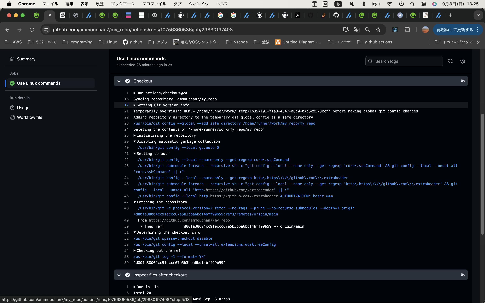
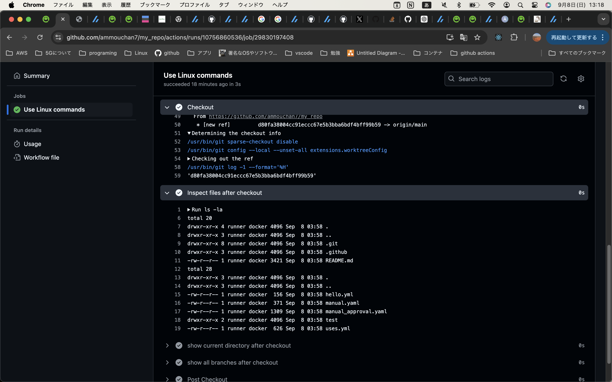

# 検証
### outputsについて
````yaml
jobs:
  print-vars:
    runs-on: ubuntu-latest
    outputs:
        test: ${{ steps.set-output-step.outputs.result }} #steps.OUTPUTを設定したstepのid名.outputs.変数名
    steps:
      - name: Set Output
        id: set-output-step  # idを指定
        run: |
          echo "result=TEST" >> $GITHUB_OUTPUT
          echo "GITHUB_OUTPUT: $GITHUB_OUTPUT" 

        #出力結果　GITHUB_OUTPUT: /home/runner/work/_temp/_runner_file_commands/set_output_e0772e5a-3e74-458a-915b-93e8ceb1e77a  

        #表示されたファイルパスは、GitHub Actionsが内部で使用する一時ファイルのパスであり、出力変数を設定するためのものでした。このファイルを通じて、resultという名前の出力変数がTESTという値に設定されます。
````
````yaml
  hello:
      - name: Use Output from Previous Job
        run: |
          echo " Output from print-vars job: ${{ needs.print-vars.outputs.test }} "
        #need.output設定元のジョブ名.outputs.変数名
````

### 手動承認について
以下の記事を参考にEnvironmentにPRODを作成し、Required reviewersに承認者を設定する
https://zenn.dev/ore88ore/articles/github-actions-approval-flow  

手動承認したいジョブのenvironmentにgithub上で設定した環境名を記載する
````yaml
  hello:
    needs: print-vars
    runs-on: ubuntu-latest
    environment:  PROD
````

### 条件分岐について
### ansibleコンテナを入れたい
### steps:usesについて
https://qiita.com/shun198/items/14cdba2d8e58ab96cf95

/home/runner/work/<リポジトリ名>/<リポジトリ名>
↑自身で作成されたワークフローを実行するパスのことで$GITHUB_WORKSPACEという環境変数を読み込んで実行
　GITHUB_WORKSPACE=/home/runner/work/<リポジトリ名>/<リポジトリ名>

actions/checkout@v4を実行すると以下の処理が実行される  
　1.ランナー内のリポジトリのGitの処理設定  
　2. Gitの認証設定  
　3. リモートリポジトリから処理を実行するブランチのリポジトリのソースコードをfetch  
　4. fetchしたソースコードと同じブランチをチェックアウト  

ランナー内にリモートリポジトリにあるソースコードをクローンに限りなく近い形(厳密には違う)で複製している  
クローンだとデフォルトのブランチ(main、develop)のソースコードしか抽出できず、  
作業する際に使うfeatureブランチのソースコードだけテストできないからfetchとcheckoutをしているのだと想定できる  



```
/usr/bin/git -c protocol.version=2 fetch --no-tags --prune --no-recurse-submodules --depth=1 origin +d80fa38004cc91eccc67e5b3bba6bdf4bff99b59:refs/remotes/origin/main
```

#### 1. `/usr/bin/git`
- これは Git コマンドの実行場所です。`/usr/bin/git` はシステムにインストールされている Git の実行ファイルです。

#### 2. `-c protocol.version=2`
- Git が使用するプロトコルのバージョンを指定しています。`protocol.version=2` は Git の通信プロトコルのバージョン2を使用するという意味です。これは、より効率的で高速な通信ができるように設計されています。

#### 3. `fetch`
- リモートリポジトリからデータを取得（フェッチ）する Git コマンドです。`fetch` は、リモートリポジトリからデータをローカルに取り込みますが、作業ツリーには変更を反映しません。取得のみです。

#### 4. `--no-tags`
- タグをフェッチしないオプションです。通常、Git はリモートリポジトリからタグも一緒にフェッチしますが、`--no-tags` を指定することでタグの取得を省略します。

#### 5. `--prune`
- リモートトラッキング参照（ブランチやタグなど）を整理します。リモートリポジトリで削除されたブランチが、ローカルリポジトリでも削除されるようにします。

#### 6. `--no-recurse-submodules`
- サブモジュールを再帰的にフェッチしないオプションです。サブモジュールが含まれている場合、そのサブモジュールのデータはフェッチされません。

#### 7. `--depth=1`
- 履歴の深さを指定してフェッチします。この場合、最新の1つのコミットだけをフェッチします。浅いクローン（シャロークローン）と呼ばれ、効率的で高速な操作が可能です。

#### 8. `origin`
- リモートリポジトリの名前です。通常、`origin` はクローンしたときに自動的に作成されるデフォルトのリモートリポジトリ名です。

#### 9. `+d80fa38004cc91eccc67e5b3bba6bdf4bff99b59:refs/remotes/origin/main`
- **`d80fa38004cc91eccc67e5b3bba6bdf4bff99b59`** は特定のコミットハッシュです。このコミットをリモートの `origin/main` ブランチに対応するリファレンスにフェッチします。
  - `+` は強制的な更新（フォースフェッチ）を意味します。リモートリポジトリで変更された場合、ローカルでも強制的にその変更を反映させます。

#### コマンドの全体的な意味
このコマンドは、リモートリポジトリ（`origin`）から最新のコミット1つ（`d80fa38004cc91eccc67e5b3bba6bdf4bff99b59`）を、サブモジュールやタグをフェッチせずに、ローカルの `origin/main` ブランチに強制的に反映しようとしています。また、リモートリポジトリで削除された参照もローカルから削除します。

↓対象ブランチのディレクトリ・ファイルを確認


# 参考資料
https://zenn.dev/hsaki/articles/github-actions-component


### composite actionについて
https://tsgcpp.hateblo.jp/entry/2022/09/25/135115


# 作業メモ


<details>
<summary>AIメモ</summary>

````yaml
 
`if: ${{ needs.deploy.result == 'failure' }}` と `if: ${{ failure() }}` の違いについて説明します。

### 1. `if: ${{ needs.deploy.result == 'failure' }}`
- **条件:** `deploy`ジョブの結果が "failure" であるかどうかをチェックします。
- **動作:** これは、`deploy`ジョブ全体の最終的な結果（成功か失敗か）を元に判断します。`deploy`ジョブが失敗した場合のみ、その後のジョブが実行されます。
- **注意点:** 手動承認で拒否された場合、GitHub Actionsは `deploy` ジョブを「失敗」とは見なさないため、この条件では拒否がトリガーされないことがあります。したがって、承認が拒否された場合には、この条件分岐では次のジョブが実行されません。

### 2. `if: ${{ failure() }}`
- **条件:** 前のジョブが「失敗した」かどうかを確認します。
- **動作:** `failure()` は、前のステップまたはジョブが失敗した場合に真になります。手動承認が拒否された場合も「失敗」として扱われるため、この条件で次のジョブが実行されます。
- **柔軟性:** この方法は、手動承認の結果が「拒否」であっても、次のジョブをトリガーするためのより確実な方法です。

**まとめ:** 手動承認で「拒否」された場合でも次のジョブを確実に実行したいのであれば、`if: ${{ failure() }}` を使用する方が確実です。`deploy.result` に頼ると、手動承認の結果が「失敗」として処理されないことがあるため、期待通りに動作しないことがあります。
````
</details>
